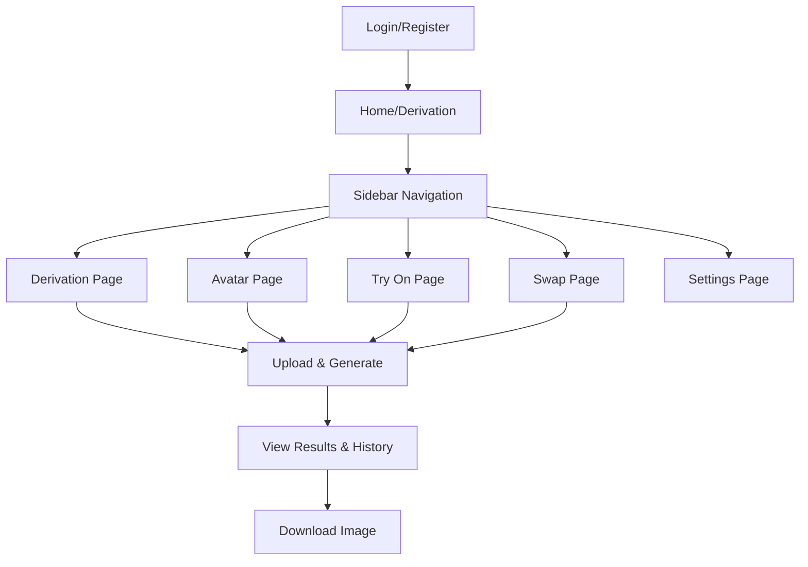

## 1. Product Overview
Viba Studio is an AI-powered image generation and manipulation platform that allows users to create, edit, and transform images using advanced generative models.
It solves the problem of complex image editing by providing intuitive tools for virtual try-on, face swapping, avatar creation, and creative image derivation, targeting content creators, designers, and casual users who want professional-quality results without deep technical expertise.

## 2. Core Features

### 2.1 User Roles
| Role | Registration Method | Core Permissions |
|------|---------------------|------------------|
| User | Email registration | Access all AI generation features, manage history, configure settings |

### 2.2 Feature Module
Our product requirements consist of the following main pages:
1. **Login/Register**: User authentication and account creation.
2. **Derivation**: Generate creative variants of an uploaded image.
3. **Avatar**: Create consistent character avatars from reference photos.
4. **Try On**: Virtual clothing try-on using a model image and a garment image.
5. **Swap**: Swap a person into a different scene or background.
6. **Settings**: Manage API keys, language preferences, and user profile.

### 2.3 Page Details
| Page Name | Module Name | Feature description |
|-----------|-------------|---------------------|
| **Login/Register** | Authentication | • Login with email and password. • Register new account with email, password, and full name. • Secure token-based session management. |
| **Derivation** | Image Input | • Upload a base image for variation generation. |
| | Controls | • Adjust creativity intensity (0-10). • Generate description from image (Image-to-Text). |
| | Generation | • Generate multiple creative variants based on the base image and description. • Display generated images in a grid. |
| **Avatar** | Reference Input | • Upload multiple reference photos to train/define the character. |
| | Generation | • Generate a high-quality, professional character image based on references. • Maintain consistency in facial features and body shape. |
| **Try On** | Inputs | • Upload Model Image (Step 1). • Upload Garment Image (Step 2). |
| | Process | • Generate a realistic image of the model wearing the garment. • Preserve garment details and model pose. |
| | History | • View list of past try-on jobs with status (Processing, Success, Failed). • Preview and download results. |
| **Swap** | Inputs | • Upload Source Image (Person). • Upload Scene Image (Background/Target). |
| | Process | • Compose the person from the source into the scene. • Harmonize lighting and shadows. |
| **Settings** | Configuration | • Set/Update Google Gemini API Key. • Change application language. • View user profile information. |

## 3. Core Process
**User Flow**
1.  **Authentication**: User logs in or registers.
2.  **Configuration**: User sets up their API key in Settings (if not already set).
3.  **Selection**: User navigates to a specific tool (Derivation, Avatar, Try On, Swap) via the sidebar.
4.  **Operation**: User uploads required images and initiates the generation process.
5.  **Review**: User views the generated results, history, and downloads the output.

## 4. User Interface Design
### 4.1 Design Style
-   **Primary Color**: Blue (`blue-600` for actions, `blue-50` for backgrounds).
-   **Secondary Color**: Purple (for accents/secondary steps).
-   **Layout**: Sidebar navigation with a main content area. Card-based layout for inputs and history items.
-   **Buttons**: Rounded corners (`rounded-full` or `rounded-lg`), flat design with shadow on hover.
-   **Icons**: Lucide React icons (clean, outlined style).
-   **Font**: Sans-serif (system default or Inter).

### 4.2 Page Design Overview
| Page Name | Module Name | UI Elements |
|-----------|-------------|-------------|
| **App Layout** | Sidebar | • Vertical navigation menu with icons. • User profile summary at the bottom. |
| **Try On** | Input Section | • Two large card slots for Model and Garment uploads. • Numbered steps (1 & 2) with color coding (Blue & Purple). • Central "Generate" button with loading state. |
| | History Feed | • List of cards showing input thumbnails and large result preview. • Status badges (Success, Processing, Failed). • Hover actions for Download and Maximize. |
| **Settings** | Form | • Simple form layout for API Key input. • Dropdown for Language selection. |

### 4.3 Responsiveness
-   **Desktop-First**: Optimized for large screens to view high-quality images.
-   **Adaptive**: Layout adjusts to flex columns on smaller screens (e.g., History feed items stack vertically).
