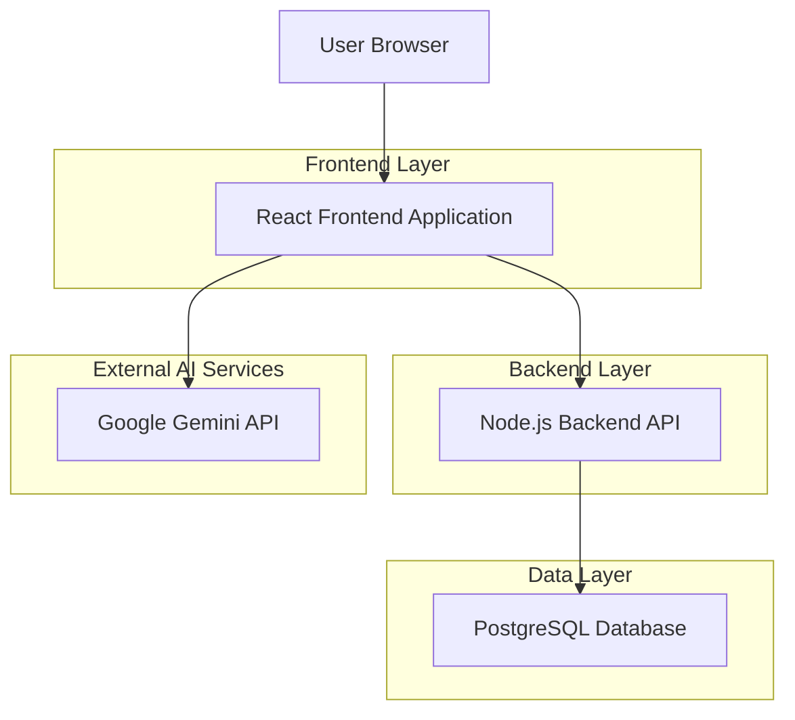
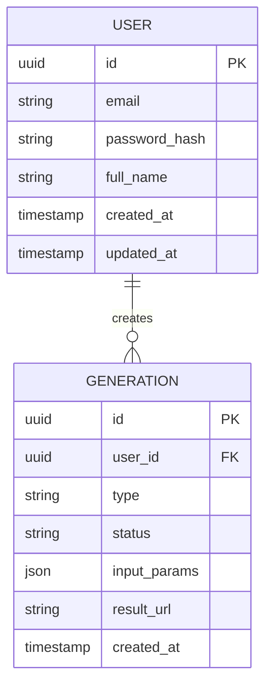

## 1. Architecture Design

The application follows a client-server architecture. The frontend is a Single Page Application (SPA) built with React, which communicates with a custom Node.js/Express backend for user authentication and data persistence. For AI image generation tasks, the frontend interacts directly with the Google Gemini API using a "Bring Your Own Key" (BYOK) model, or potentially proxies through the backend depending on the specific implementation of the service layer (currently direct).



## 2. Technology Description
-   **Frontend**:
    -   React (UI Library)
    -   Vite (Build Tool)
    -   Tailwind CSS (Styling)
    -   React Router DOM (Routing)
    -   Context API (State Management)
    -   Google GenAI SDK (AI Integration)
-   **Backend**:
    -   Node.js (Runtime)
    -   Express (Web Framework)
    -   Sequelize (ORM)
    -   PostgreSQL (Database)
    -   JSON Web Token (Authentication)
    -   Bcryptjs (Password Hashing)

## 3. Route Definitions
| Route | Purpose |
|-------|---------|
| `/login` | User login page |
| `/register` | User registration page |
| `/` | Protected root, redirects to `/derivation` |
| `/derivation` | Image derivation/variation tool |
| `/avatar` | Avatar generation tool |
| `/tryon` | Virtual try-on tool |
| `/swap` | Face/Scene swap tool |
| `/settings` | User settings and API key configuration |

## 4. API Definitions

### 4.1 Core API (Backend)

**Authentication**
-   `POST /api/v1/auth/register`: Register a new user.
-   `POST /api/v1/auth/login`: Authenticate user and receive tokens.
-   `POST /api/v1/auth/refresh-token`: Refresh access token.

**User**
-   `GET /api/v1/users/me`: Get current user profile.

### 4.2 AI Service (Frontend Integration)
The frontend directly calls Google Gemini API methods via the SDK.
-   `generateContent`: Used for Text-to-Image and Image-to-Image tasks (Derivation, Avatar, TryOn, Swap).

## 5. Server Architecture Diagram

```mermaid
graph TD
  A[Client Request] --> B[Express Middleware]
  B --> C[Auth Middleware]
  C --> D[Controllers/Routes]
  D --> E[Services (AuthService, etc.)]
  E --> F[Sequelize Models]
  F --> G[(PostgreSQL Database)]

  subgraph "Backend Server"
      B
      C
      D
      E
      F
  end
```

## 6. Data Model

### 6.1 Data Model Definition



### 6.2 Data Definition Language (Example)

**User Table**
```sql
CREATE TABLE users (
    id UUID PRIMARY KEY DEFAULT gen_random_uuid(),
    email VARCHAR(255) UNIQUE NOT NULL,
    hashed_password VARCHAR(255) NOT NULL,
    full_name VARCHAR(255),
    created_at TIMESTAMP WITH TIME ZONE DEFAULT NOW(),
    updated_at TIMESTAMP WITH TIME ZONE DEFAULT NOW()
);
```
